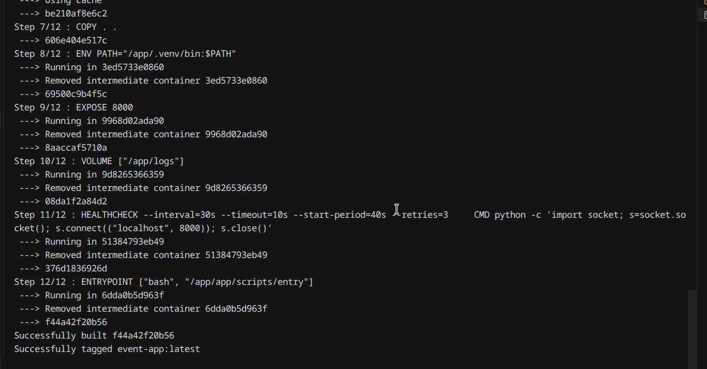
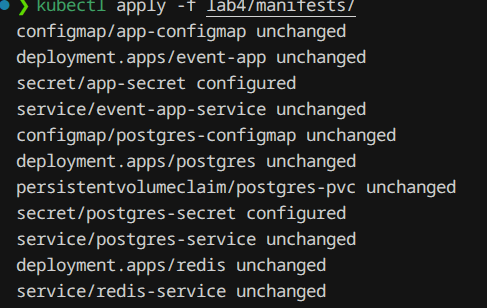
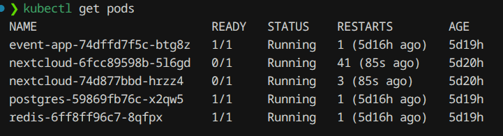
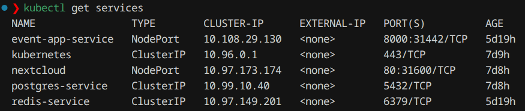
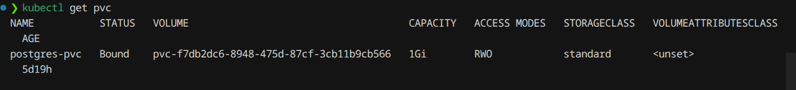
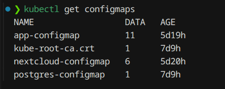
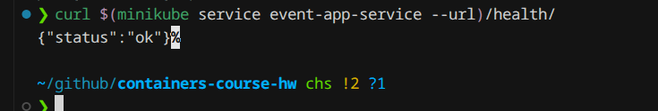

# Лабораторная работа 4: Kubernetes

## Задание

Развернуть собственный сервис в Kubernetes с:
- Минимум 2 Deployment + 1 init-контейнер
- Кастомный образ
- Volume
- ConfigMap и Secret
- Service
- Liveness/Readiness probes
- Labels

## Файлы

```
lab4/manifests/
├── postgres-configmap.yml
├── postgres-secret.yml
├── postgres-pvc.yml
├── postgres-service.yml
├── postgres-deployment.yml
├── redis-service.yml
├── redis-deployment.yml
├── app-configmap.yml
├── app-secret.yml
├── app-service.yml
└── app-deployment.yml
```

## Ход работы

### 1. Сборка образа



### 2. Применение манифестов



### 3. Проверка подов



### 4. Сервисы



### 5. PVC



### 6. ConfigMaps



### 7. Health endpoint



## Выполнено

| Требование | Реализация |
|------------|------------|
| 2+ Deployment | postgres, redis, event-app |
| Init-контейнер | db-migrate (миграции БД) |
| Кастомный образ | event-app:latest |
| Volume | postgres-pvc |
| ConfigMap | postgres-configmap, app-configmap |
| Secret | postgres-secret, app-secret |
| Service | 3 сервиса |
| Probes | Liveness + Readiness на всех |
| Labels | app, tier |
